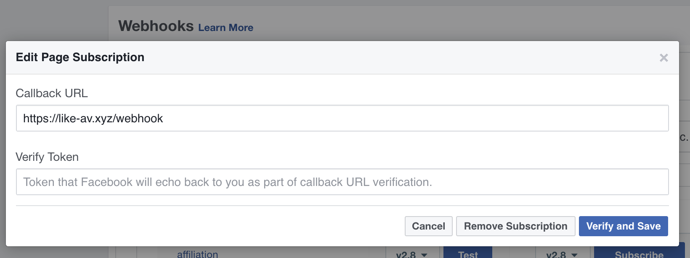
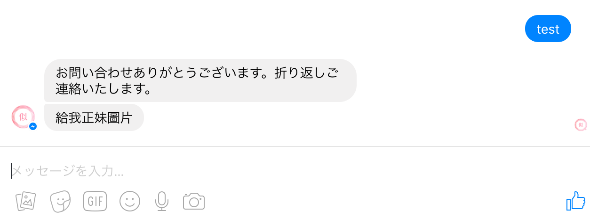
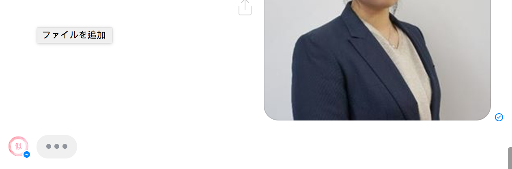
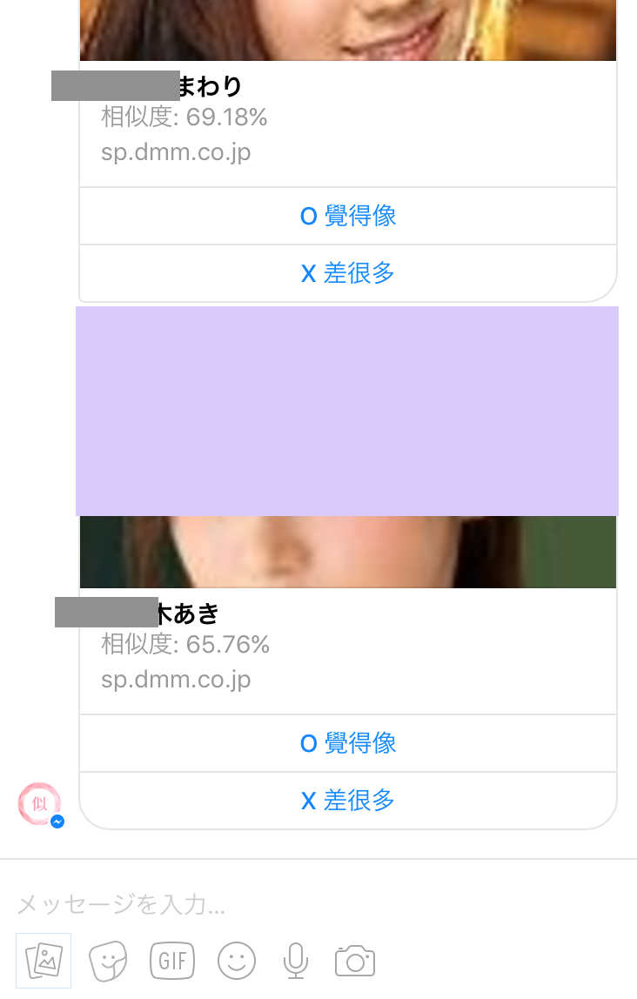
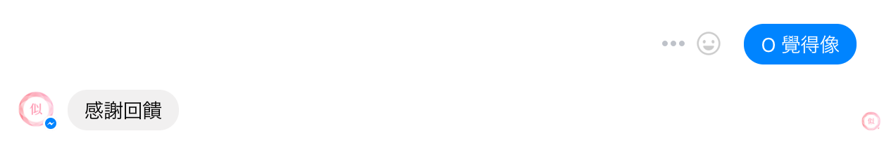
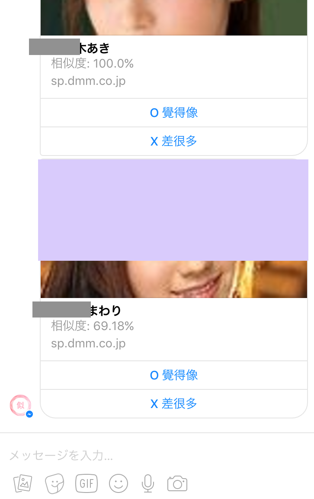
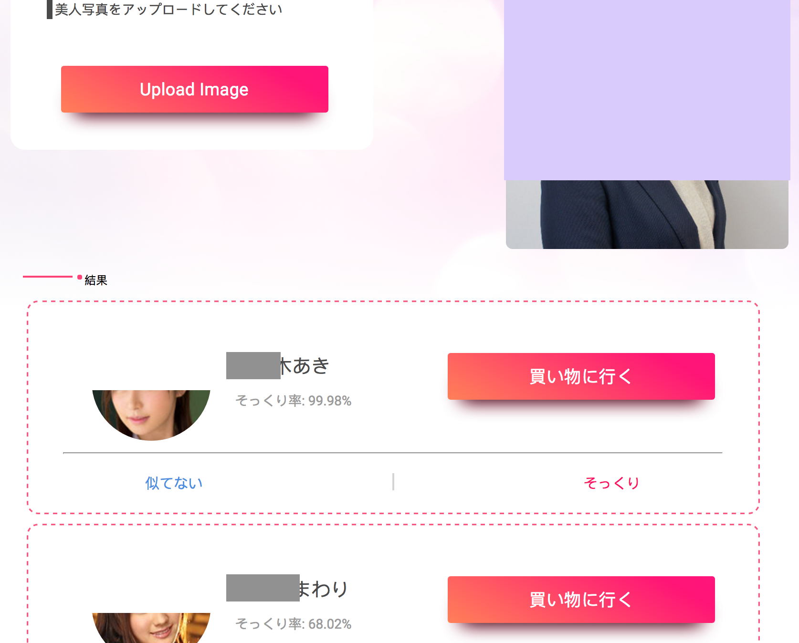
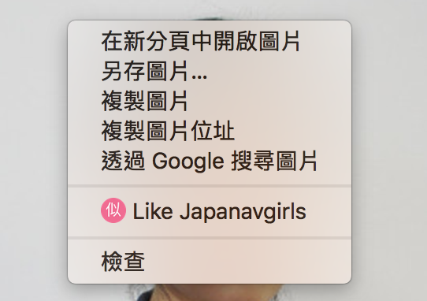
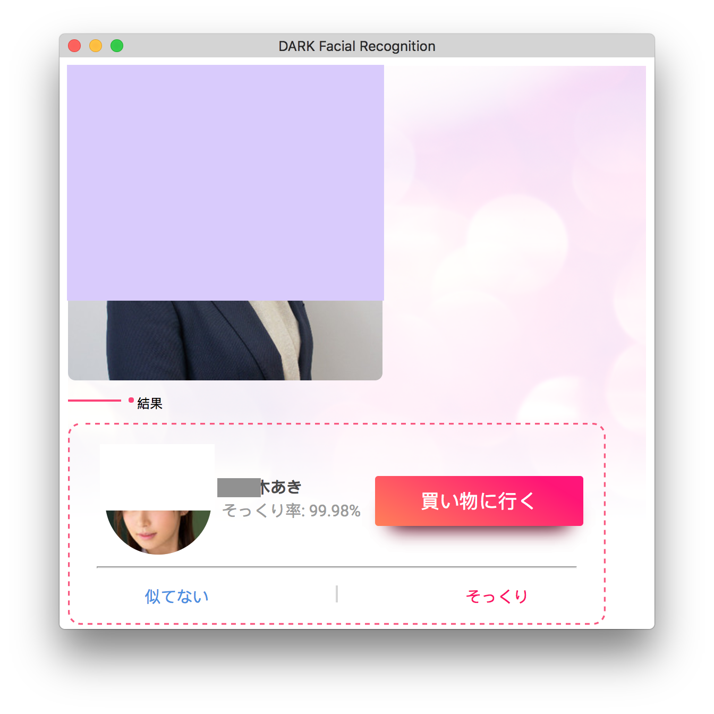

# like-japanavgirls

## Structure


## Preparement
1. register domain name with [お名前.com](http://www.onamae.com/)
1. Let's Encrypt certificate authority with [NGINX](https://github.com/Jim-Lin/like-japanavgirls/blob/master/etc/nginx/sites-available/default)
    - 80: web/
    - 5000: bot/server.py
    - 9090: api/main.go

## Facebook Messenger Bot with Python
### requisites
* requests
* beautifulsoup4
* boto3
* tornado
* pymongo

### face data (daily cron job)
- bot/scheduler.py: import ETL class from bot/etl.py to **fetch monthly, daily, and work face data**
    - ETL: import AWS class from bot/aws.py and DAO class from bot/dao.py
        - AWS: insert_index_face for **insert face data with index of ExternalImageId** and search_faces for **search faces' similarity above 20%**
        - DAO: **mongodb find and update operation**

#### mongodb sample document
```json
{
    "_id": ObjectId("5877d3f47b991c5356a45xxx"),
    "id": "103xxx",
    "img": "http://pics.dmm.co.jp/mono/actjpgs/xxx.jpg",
    "name": "XXX",
    "works": [ 
        "2wwkxxx",
        ...
    ],
    "count": 2,
    "like": [ 
        "2017-03-13/17204117_xxx.jpg"
    ],
    "unlike": [ 
        "2017-03-13/5_xxx.jpg"
    ]
}
```

### webhook
- bot/server.py: launch webhook handler server for facebook app  

___

- bot/handler.py: post function for two type event
    - message: **text** or **attachments** data
    - postback: user's feedback **payload** data to improve accuracy

### facebook bot sample operation
- text  

___

- attachment  

___

___

- payload: if you think the second one is more similar than first one, press **O** button and send the same image again, and then you will get the new similarity order  
  
___

___

## Back-end Api Server with Go
### requisites
* github.com/aws/aws-sdk-go
* github.com/aws/aws-sdk-go/aws/...
* github.com/aws/aws-sdk-go/service/...
* gopkg.in/mgo.v2

## Front-end with native JavaScript
### [upload](https://github.com/Jim-Lin/like-japanavgirls/blob/master/web/app.js#L165-L200)
- url: http://like-av.xyz/api/upload
- method: POST
- form-data: {upload: \<blob\>}

#### response sample json
```json
{
    "Count": 2,
    "Data" : [ 
        {
        	"Id": "102xxx",
        	"Img": "http://pics.dmm.co.jp/mono/actjpgs/nakamura_xxx.jpg",
        	"Name": "中村xxx",
        	"Similarity": "76.54"
        },
        ...
    ],
    "File" : "2017-03-20/12274445_xxx.jpg"
}
```


___

### [feedback](https://github.com/Jim-Lin/like-japanavgirls/blob/master/web/app.js#L11-L33)
- url: http://like-av.xyz/api/feedback
- method: POST
- json-data: {id: \<id\>, ox: \<ox\>, file: \<filename\>}

## Chrome-Extension
### install
https://chrome.google.com/webstore/detail/like-japanavgirls/ehhdbpobmjcndjibgblgnbgmhjmfmhae

### context menu
- chrome-extension/background.js: set up context menu tree at install time and only for image context  

___

___
